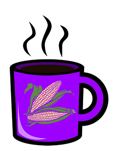

# welcome to the kernel café!

The kernel café is a volunteer-run virtual hackerspace for open-source developers and fans.

We provide public infrastructure with new technologies, such as interactive access to ARM & RISCV hardware, IPv6 networking, bleeding-edge kernels, a public mixed-architecture Kubernetes cluster. Most nodes are located in San Francisco, though we are beginning to bring global nodes online as well. 

## Getting access

Just send us a PR that adds your username to the bottom of [auth/users.yaml](auth/users.yaml). Once merged, you will be added to the organization, and able to SSH in with to `<hostname>.kernel.cafe` with the SSH keys you have provided to GitHub (IPv6 required)

## What's the state of the café?

As of Feb 14, 2021, the kernel café is in alpha. We are adding machines weekly, and improving our automation to scale out faster. The nodes are not yet considered stable, but will be when the café hits beta on March 1st.

## Donations

* We are not yet accepting monetary donations, but plan to accept donations to offset power consumption costs via Paypal & GitHub sponsors.
* We are accepting nodes from the community to come join in ([documentation](https://github.com/KernelCafe/automation/)). 
* We are accepting hardware donations for hosts running modern CPU architectures, with a strong preference towards low power consumption. We are very much interested in improving our support for riscv, mips, and ppc64le.

## Available Infrastructure

| Hostname     | Alias         | Arch    | Distro      | Hardware                  | Cores | Mem (GB) |
| ------------ | ------------- | ------- | ----------- | --------------------------- | ----- | -------- |
| min          | macos.arm64   | arm64   | macOS       | Apple Mac Mini (M1)         | 8     | 16       |
| max          | macos.amd64   | x86-64  | macOS       | Apple Mac Mini (i7)         | 6     | 32       |     
| pi           |               | arm64   | Raspbian    | Raspberry Pi 4              | 4     | 8        |
| x            | linux.arm64.  | arm64   | Ubuntu      | Nvidia AGX Xavier           | 8     | 32       |
| pan          | freebsd.amd64 | x86-64  | FreeBSD     | Asus PN50 (Ryzen 4700U)     | 8     | 4        |
| shrimp-paste | linux.ppc64le | ppc64le |  Fedora     | Raptor Blackbird POWER9 🌏  | 8     | 64       | 

* 🌏 - Hosted in Australia by <a href="https://github.com/runlevel5">@runlevel5</a>

## Incoming Infrastructure (Feb 2021)

| Hostname     | Alias           | Arch      | Distro       | Hardware                      | Cores |  Mem (GB) |
| ------------ | --------------- | --------- | ------------ | ----------------------------- | ----- | --------- | 
| omega        | linux.mips      | mips      | OpenWRT      | Onion Omega2 Dash             | 1     | 128MB     |
| honey        | linux.arm64     | arm64     | Arch         | SolidRun Honeycomb LX2        | 16    | 64        |
| rad          | linux.arm32     | arm32     | Raspbian     | Raspberry Pi 3                | 4     | 2         |
| arctan       | linux.amd64     | x86-64    | OpenSUSE     | HP ProDesk G2 (i7-6700T)      | 4     | 16        |
| toaster      | netbsd.amd64    | x86-64    | NetBSD       | HP ProDesk G2 (i7-6700T)      | 4     | 16        |
| k            | kubernetes      | (various) | Kubernetes   | (various)                     | 32+   | 100+      |

## Coming Mar 2021 (beta)

| Hostname     | Alias           | Arch      | Distro       | Hardware                   | Cores |  Mem (GB) |
| ------------ | --------------- | --------- | ------------ | -------------------------- | ----- | --------- |
| dory     |                 | arm64     | Fedora       | RockPro64                  | 6     | 4         |
| nemo  | netbsd.arm64    | arm64     | NetBSD       | RockPro64                  | 6     | 4         |
| bruce     |                 | arm64     | Arch Linux   | RockPro64                  | 6     | 4         |

## Coming Later (post-release)

* Linux/riscv (SiFive Unleashed)
* FreeBSD/arm64 (RockPro64)
* Linux/ppc64le (Talos Blackbird)
* Windows/x86-64 (Threadripper 1950X)
* Dragonfly/x64 (QEMU)
* Linux/s390x (QEMU)
* ReactOS/x86 (QEMU)
* Fuschia (TBD)
